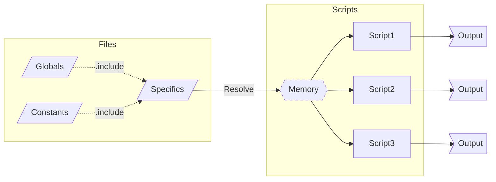

# Json Extensible Resource Configuration
>This document covers the specification detail for JERC `v0.2-beta (Jan 2023)`.

An open-source specification of an extensible format for creating resource configurations for any purpose.

## 0. Meta information

### 0.1. Version History
**v0.2-beta (January 2023)**
* Improved templating syntax

**v0.1-beta (December 2022)**
* Initial specification

### 0.2. Goals
1. Simple format (valid JSON) for modeling configuration values for any type of resource.
2. Hierarchy of reusable and componentised files and values that is easy to trace.
3. Simple language for defining dynamic configuration values.

### 0.3. Concepts
This specification makes reference to certain internal concepts:
* **Aspect:** A named set of configuration values that can be applied to a resource.
* **Include:** A reference to another configuration file to be included as part of the processing.
* **Resource:** A named set of configuration values that will be returned after processing.
* **Template:** A piece of logic that will be transformed after processing to resolve its value.

### 0.4. Usage life-cycle
1. Create resource configuration files.
2. Process configuration files to in-memory dictionary of key-values per resource.
3. (Out of scope of specification) Use result structures in target processes.

### 0.5. Example use
JERC was created to solve situations such as being able to define a single configuration file hierarchy that can be used to produce multiple outputs.

**Example:**


### 0.6. Correctness
A suite of correctness files is included in this repository to prove the accuracy of the implementation.

### 0.7. Roadmap
The list of potential features being considered is [available here](future.md).

## 1. Specification
### 1.1. Requirements
Every implementation of the specification must meet the following criteria:
1. Support comments in JSON files ("[jsonc](https://code.visualstudio.com/docs/languages/json#_json-with-comments)").
2. Provide a mechanism to report warnings raised during processing.
3. Support standard JSON types: array, boolean, dictionary, null, number, string.
4. Relative file paths are resolved from the current file.

### 1.2. File structure
Every JERC file can implement the following structure:
```json
{
    // List of files to be included in to this one
    ".include": [ ... ],

    // Named resource aspects
    "aspects": {
        "aspect1": {
            ".aspects": [ ... ] // List of aspects to apply to this aspect
            // Aspect keys
        },
        ...
    },

    // Named resources
    "resources": {
        "resource`": {
            ".aspects": [ ... ] // List of aspects to apply to this resource
            // Resource keys
        },
    }
}
```

All keys are optional, and any additional keys are ignored by JERC processors.

### 1.3. Processing steps
The implementation of the specification expects a configuration file to be processed in the following order:
1. Resolve all included files (merge aspects and resources).
   1. Each file in the ".includes" list is processed in order, with additional values added to the start of the list.
   2. Files can be referenced for inclusion multiple times.
   3. A recursion loop must fail processing of the files with a suitable message.
2. Resolve all aspects (apply other aspects).
   1. Each aspect in the ".aspects" list is processed in order, with additional values added to the start of the list.
3. Apply aspects to resources.
   1. Each aspect in the ".aspects" list is processed in order, with additional values added to the start of the list.
4. Warn on unprovided values (an applied `null` aspect value that was not explicitly defined at the resource level).
   - This can happen during step 3.
5. Transform all templates.
    - See the [templates documentation](templates.md).
6. Make all resources available by name.

#### 1.3.1. Key-value priority
When combining sets (e.g., aspect/resource collision on include, aspect applying to aspect/resource), the value of the incoming key is only taken if:
1. the key has not been defined on the target, or
2. the key has a value of `null` on the target.

To force a `null` in to the hierarchy for a key, the `"{!}null"` [template](templates.md) will be treated like any non-`null` value until it is resolved at [step 5](#processing-steps).

## 2. Implementations
### 2.1. Implementation API
The minimum API of an implementation of the specification should provide:
* A method that takes a single file path and returns a dictionary of all resources with the resultant configured key-values.

Additional methods that make it easier for a consumer to locate issues in their files could include a way to output the state at each of the steps when processing a configuration file:
* The list of all files that will be processed.
* The resolved aspects and resources from all included files.
* The resolved list of resources after applying aspects (before transformations).

## 3. Templating
Dynamic values are resolved using the [templating language](templates.md).